&nbsp;

<div align="center">

<p align="center">  </p>

[](https://arxiv.org/abs/2506.23361)&nbsp;
[](https://caiyuanhao1998.github.io/project/OmniVCus/)&nbsp;
<a href="https://huggingface.co/datasets/CaiYuanhao/OmniVCus-Train">
  
</a>
<a href="https://huggingface.co/datasets/CaiYuanhao/OmniVCus-Test">
  
</a>
<a href="https://huggingface.co/CaiYuanhao/OmniVCus">
  
</a>

<h4>[NeurIPS 2025] OmniVCus: Feedforward Subject-driven Video Customization with Multimodal Control Conditions</h4> 

<p align="center">
  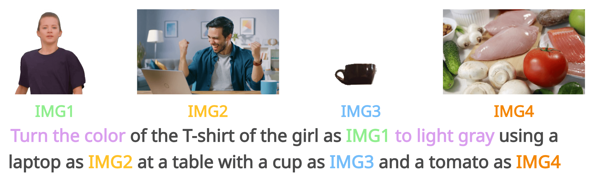
  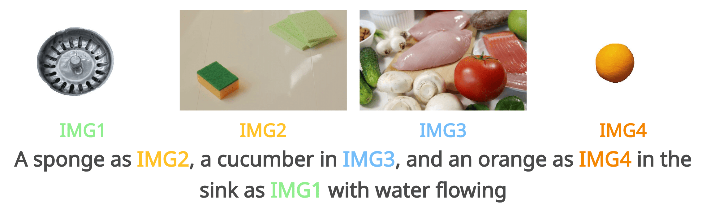
  
  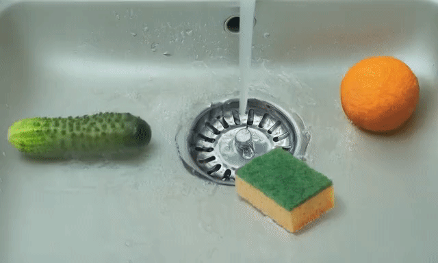
</p>


&nbsp;

</div>


### Introduction
This is a re-implementation of our work "OmniVCus: Feedforward Subject-driven Video Customization with Multimodal Control Conditions" using public datasets and re-trained model based on public codes. In this work, we present a data construction pipeline that can create data pairs and a diffusion Transformer for subject-driven video customization under different control conditions. I will continue to complete this repo. If you find our repo useful, please give it a star ⭐ and consider citing our paper. Thank you :)


<p align="center">
  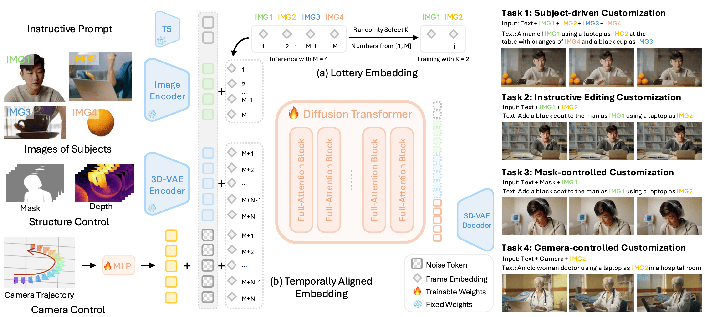
</p>

<p align="center">The overall framework of our OmniVCus</p>


### News
- **2025.12.26 :** Training and testing codes, training data, and pre-trained models have been released. Please feel free to check and try. 🚀
- **2025.12.03 :** The data construction code has been uploaded. I will continue refine and construct this repo. Stay tuned. 💫
- **2025.09.19 :** Our paper has been accepted by NeurIPS 2025. 🎉 🎊
- **2025.06.30 :** Our paper is on [arxiv](https://arxiv.org/abs/2411.14384) now. 🚀
- **2025.06.28 :** Our [project page](https://caiyuanhao1998.github.io/project/OmniVCus/) has been built up. Feel free to check the video generation results on the project page.


### Comparison with State-of-the-Art Methods

<details open>
<summary><b>Qualitative Comparison</b></summary>

&nbsp;

<p align="center">
<table border="0" cellspacing="0" cellpadding="0" style="border-collapse:collapse;border:0;">

  <!-- ===== Row 1 Prompt ===== -->
  <tr>
    <td colspan="2" align="center" style="border:0;padding:6px 10px;font-style:italic;">
      Prompt: The woman in <span style="color: green;">IMG1</span> is talking to a man on a street
    </td>
  </tr>
  <tr>
    <td style="border:0;padding:10px;">
      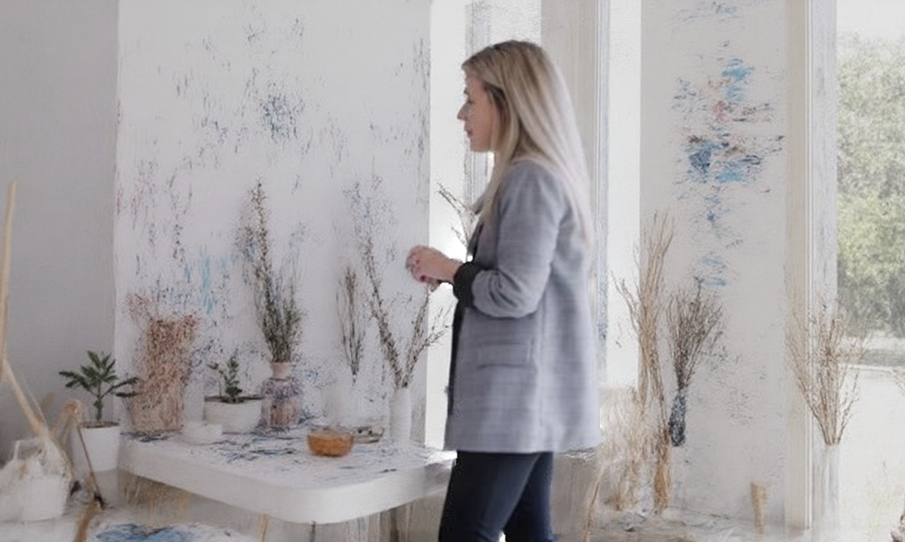
    </td>
    <td style="border:0;padding:10px;">
      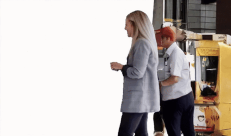
    </td>
  </tr>
  <tr>
    <td align="center" style="border:0;padding-top:6px;font-weight:700;">Reference Image</td>
    <td align="center" style="border:0;padding-top:6px;font-weight:700;">SkyReels-A2</td>
  </tr>
  <tr>
    <td style="border:0;padding:10px;">
      
    </td>
    <td style="border:0;padding:10px;">
      
    </td>
  </tr>
  <tr>
    <td align="center" style="border:0;padding-top:6px;font-weight:700;">OmniGen + Wan2.1-I2V-14B</td>
    <td align="center" style="border:0;padding-top:6px;font-weight:700;">OmniVCus (Ours) - Felix2-5B</td>
  </tr>
</table>
</p>

</details>

&nbsp;

<details close>
<summary><b>Quantitative Comparison</b></summary>


</details>

&nbsp;

<details open>
<summary><b>To-Do List:</b></summary>

* [x] ~~Release training data and testing data samples~~
* [x] ~~Release the code of our data construction pipeline(VideoCus-Factory)~~
* [x] ~~Re-implement inference code and models based on open-source repo~~
* [x] ~~Re-implement training code based on open-source repo~~
* [x] ~~Release Training Data~~


</details>

&nbsp;
&nbsp;

## 1. Data Construction

We implement our data construction pipeline in the folder [`VideoCus-Factory`](https://github.com/caiyuanhao1998/Open-OmniVCus/tree/master/VideoCus-Factory), which can construct the multi-modal control conditions including subjects, depth, mask, motion, etc. We also provide the code in the folder [`Video-Depth-Anything`](https://github.com/caiyuanhao1998/Open-OmniVCus/tree/master/Video-Depth-Anything) for better constructing the video depth condition. Please enter the corresponding subfolders for environment installation and data preparation. The following is an example of constructing from a raw video.

<p align="center">
<table border="0" cellspacing="0" cellpadding="0" style="border-collapse:collapse;border:0;">

  <!-- ===== Row 1 Prompt ===== -->
  <tr>
    <td colspan="3" align="center" style="border:0;padding:6px 10px;font-style:italic;">
      Generated Prompt: a woman and a child playing with a toy train.
    </td>
  </tr>
  <tr>
    <td style="border:0;padding:10px;">
      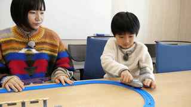
    </td>
    <td style="border:0;padding:10px;">
      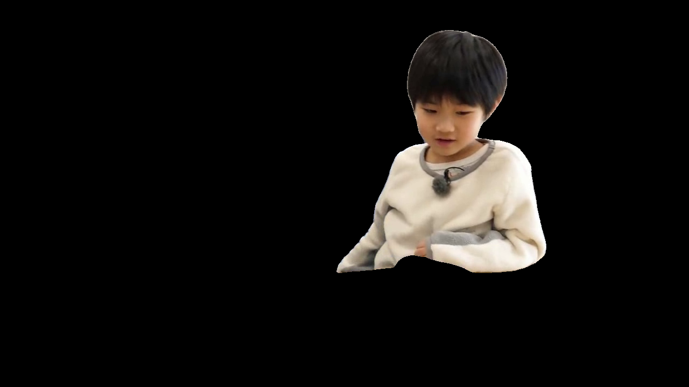
    </td>
    <td style="border:0;padding:10px;">
      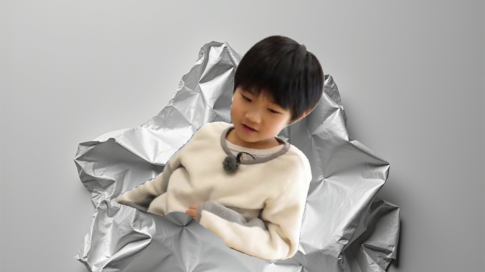
    </td>
  </tr>

  <tr>
    <td align="center" style="border:0;padding-top:6px;font-weight:700;">Original Video</td>
    <td align="center" style="border:0;padding-top:6px;font-weight:700;">Segmented Subject</td>
    <td align="center" style="border:0;padding-top:6px;font-weight:700;">Augmented Subject</td>
  </tr>

  <tr>
    <td style="border:0;padding:10px;">
      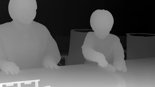
    </td>
    <td style="border:0;padding:10px;">
      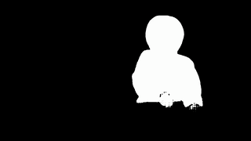
    </td>
    <td style="border:0;padding:10px;">
      
    </td>
  </tr>

  <tr>
    <td align="center" style="border:0;padding-top:6px;font-weight:700;">Depth Video</td>
    <td align="center" style="border:0;padding-top:6px;font-weight:700;">Mask Video</td>
    <td align="center" style="border:0;padding-top:6px;font-weight:700;">Motion Video</td>
  </tr>

</table>
</p>


For your convenience to do research, we provide our training and testing datasets in our huggingface pages: [[Train Set](https://huggingface.co/datasets/CaiYuanhao/OmniVCus-Train)], [Test Set]

In addition, we also provide parts of the original training and testing dataset samples in [Google Drive](https://drive.google.com/drive/folders/1SFlPN053A_DCFBGKVI-5NJtKedkVp1fJ?usp=drive_link). We  condstruct webpages in the [Google Drive](https://drive.google.com/drive/folders/1SFlPN053A_DCFBGKVI-5NJtKedkVp1fJ?usp=drive_link) for your convienience to browse the data samples as

<p align="center">
  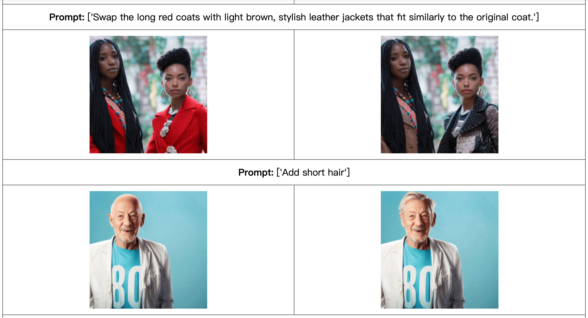
</p>


&nbsp;


## 2. Training and Inference

We re-implement our method in the folder [`DiffSynth-Studio`](https://github.com/caiyuanhao1998/Open-OmniVCus/tree/master/DiffSynth-Studio) based on `Wan2.1-1.3B`, `Wan2.1-14B`, `Wan2.2-14B`, and `VACE` models. We provide our trained models in the [huggingface website](https://huggingface.co/CaiYuanhao/OmniVCus). I write tensor-parallel testing and training code as follow.

· Model Overview

<table width="100%" style="table-layout: fixed;">
  <thead>
    <tr>
      <th style="width:40%; text-align:left;">Model ID</th>
      <th style="width:30%; text-align:center;">Inference</th>
      <th style="width:30%; text-align:center;">Training</th>
    </tr>
  </thead>
  <tbody>
    <tr>
      <td>
        <a href="https://huggingface.co/CaiYuanhao/OmniVCus">
          Wan2.1-OmniVCus-1.3B
        </a>
      </td>
      <td align="center">
        <a href="https://github.com/caiyuanhao1998/Open-OmniVCus/blob/master/DiffSynth-Studio/test_2.1_1.3B.sh">
          code
        </a>
      </td>
      <td align="center">
        <a href="https://github.com/caiyuanhao1998/Open-OmniVCus/blob/master/DiffSynth-Studio/train_2.1_1.3B.sh">
          code
        </a>
      </td>
    </tr>
    <tr>
      <td>
        <a href="https://huggingface.co/CaiYuanhao/OmniVCus">
          Wan2.1-OmniVCus-14B
        </a>
      </td>
      <td align="center">
        <a href="https://github.com/caiyuanhao1998/Open-OmniVCus/blob/master/DiffSynth-Studio/test_2.1_14B.sh">
          code
        </a>
      </td>
      <td align="center">
        <a href="https://github.com/caiyuanhao1998/Open-OmniVCus/blob/master/DiffSynth-Studio/train_2.1_14B.sh">
          code
        </a>
      </td>
    </tr>
    <tr>
      <td>
        <a href="https://huggingface.co/CaiYuanhao/OmniVCus">
          Wan2.2-OmniVCus-14B-high
        </a>
      </td>
      <td align="center">
        <a href="https://github.com/caiyuanhao1998/Open-OmniVCus/blob/master/DiffSynth-Studio/test_2.2_14B.sh">
          code
        </a>
      </td>
      <td align="center">
        <a href="https://github.com/caiyuanhao1998/Open-OmniVCus/blob/master/DiffSynth-Studio/train_2.2_14B_high.sh">
          code
        </a>
      </td>
    </tr>
    <tr>
      <td>
        <a href="https://huggingface.co/CaiYuanhao/OmniVCus">
          Wan2.2-OmniVCus-14B-low
        </a>
      </td>
      <td align="center">
        <a href="https://github.com/caiyuanhao1998/Open-OmniVCus/blob/master/DiffSynth-Studio/test_2.2_14B.sh">
          code
        </a>
      </td>
      <td align="center">
        <a href="https://github.com/caiyuanhao1998/Open-OmniVCus/blob/master/DiffSynth-Studio/train_2.2_14B_low.sh">
          code
        </a>
      </td>
    </tr>
  </tbody>
</table>


We compare our OmniVCus with the state-of-the-art method VACE as follow:

· (a) 2.1-1.3B model

<p align="center">
<table border="0" cellspacing="0" cellpadding="0" style="border-collapse:collapse;border:0;">

  <!-- ===== Row 1 Prompt ===== -->
  <tr>
    <td colspan="2" align="center" style="border:0;padding:6px 10px;font-style:italic;">
      (a1) a woman rolling up a fitted sheet
    </td>
  </tr>
  <tr>
    <td style="border:0;padding:10px;">
      
    </td>
    <td style="border:0;padding:10px;">
      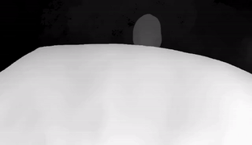
    </td>
  </tr>
  <tr>
    <td align="center" style="border:0;padding-top:6px;font-weight:700;">Reference Image</td>
    <td align="center" style="border:0;padding-top:6px;font-weight:700;">Depth Video</td>
  </tr>
  <tr>
    <td style="border:0;padding:10px;">
      
    </td>
    <td style="border:0;padding:10px;">
      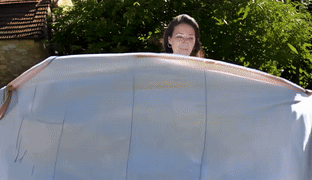
    </td>
  </tr>
  <tr>
    <td align="center" style="border:0;padding-top:6px;font-weight:700;">VACE-2.1-1.3B</td>
    <td align="center" style="border:0;padding-top:6px;font-weight:700;">OmniVCus-2.1-1.3B (Ours)</td>
  </tr>


<!-- ===== Row 2 Prompt ===== -->
  <tr>
    <td colspan="2" align="center" style="border:0;padding:6px 10px;font-style:italic;">
      (a2) a church in the winter
    </td>
  </tr>
  <tr>
    <td style="border:0;padding:10px;">
      
    </td>
    <td style="border:0;padding:10px;">
      
    </td>
  </tr>
  <tr>
    <td align="center" style="border:0;padding-top:6px;font-weight:700;">Reference Image</td>
    <td align="center" style="border:0;padding-top:6px;font-weight:700;">Mask Video</td>
  </tr>
  <tr>
    <td style="border:0;padding:10px;">
      
    </td>
    <td style="border:0;padding:10px;">
      
    </td>
  </tr>
  <tr>
    <td align="center" style="border:0;padding-top:6px;font-weight:700;">VACE-2.1-1.3B</td>
    <td align="center" style="border:0;padding-top:6px;font-weight:700;">OmniVCus-2.1-1.3B</td>
  </tr>
</table>
</p>


· (b) 2.1-14B model

<p align="center">
<table border="0" cellspacing="0" cellpadding="0" style="border-collapse:collapse;border:0;">

  <!-- ===== Row 1 Prompt ===== -->
  <tr>
    <td colspan="2" align="center" style="border:0;padding:6px 10px;font-style:italic;">
      (b1) a man holding a piece of paper in his hands
    </td>
  </tr>
  <tr>
    <td style="border:0;padding:10px;">
      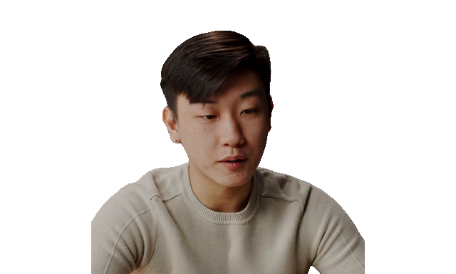
    </td>
    <td style="border:0;padding:10px;">
      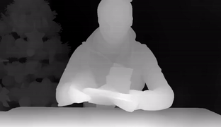
    </td>
  </tr>
  <tr>
    <td align="center" style="border:0;padding-top:6px;font-weight:700;">Reference Image</td>
    <td align="center" style="border:0;padding-top:6px;font-weight:700;">Depth Video</td>
  </tr>
  <tr>
    <td style="border:0;padding:10px;">
      
    </td>
    <td style="border:0;padding:10px;">
      
    </td>
  </tr>
  <tr>
    <td align="center" style="border:0;padding-top:6px;font-weight:700;">VACE-2.1-14B</td>
    <td align="center" style="border:0;padding-top:6px;font-weight:700;">OmniVCus-2.1-14B (Ours)</td>
  </tr>


<!-- ===== Row 2 Prompt ===== -->
  <tr>
    <td colspan="2" align="center" style="border:0;padding:6px 10px;font-style:italic;">
      (b2) a boy in a medical gown and hairnet in a hospital room
    </td>
  </tr>
  <tr>
    <td style="border:0;padding:10px;">
      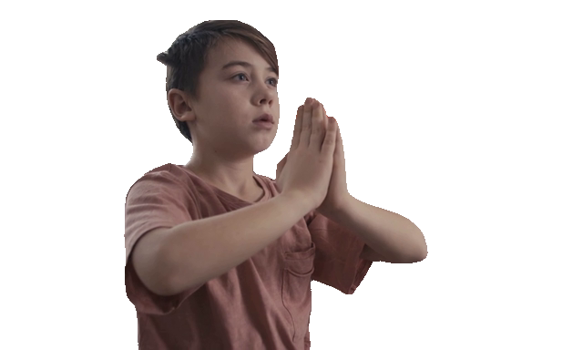
    </td>
    <td style="border:0;padding:10px;">
      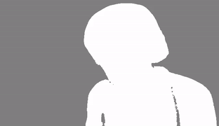
    </td>
  </tr>
  <tr>
    <td align="center" style="border:0;padding-top:6px;font-weight:700;">Reference Image</td>
    <td align="center" style="border:0;padding-top:6px;font-weight:700;">Mask Video</td>
  </tr>
  <tr>
    <td style="border:0;padding:10px;">
      
    </td>
    <td style="border:0;padding:10px;">
      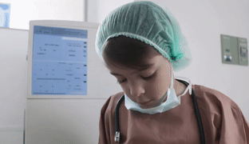
    </td>
  </tr>
  <tr>
    <td align="center" style="border:0;padding-top:6px;font-weight:700;">VACE-2.1-14B</td>
    <td align="center" style="border:0;padding-top:6px;font-weight:700;">OmniVCus-2.1-14B (Ours)</td>
  </tr>
</table>
</p>


· (c) 2.2-14B model

<p align="center">
<table border="0" cellspacing="0" cellpadding="0" style="border-collapse:collapse;border:0;">

  <!-- ===== Row 1 Prompt ===== -->
  <tr>
    <td colspan="2" align="center" style="border:0;padding:6px 10px;font-style:italic;">
      (c1) a boy looking into an open refrigerator, with tomatoes and a bottle of water on the floor
    </td>
  </tr>
  <tr>
    <td style="border:0;padding:10px;">
      
    </td>
    <td style="border:0;padding:10px;">
      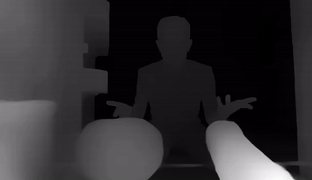
    </td>
  </tr>
  <tr>
    <td align="center" style="border:0;padding-top:6px;font-weight:700;">Reference Image</td>
    <td align="center" style="border:0;padding-top:6px;font-weight:700;">Depth Video</td>
  </tr>
  <tr>
    <td style="border:0;padding:10px;">
      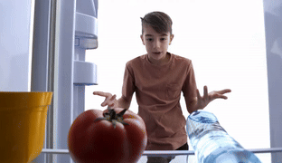
    </td>
    <td style="border:0;padding:10px;">
      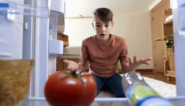
    </td>
  </tr>
  <tr>
    <td align="center" style="border:0;padding-top:6px;font-weight:700;">VACE-2.2-14B</td>
    <td align="center" style="border:0;padding-top:6px;font-weight:700;">OmniVCus-2.2-14B (Ours)</td>
  </tr>


<!-- ===== Row 2 Prompt ===== -->
  <tr>
    <td colspan="2" align="center" style="border:0;padding:6px 10px;font-style:italic;">
      (c2) a woman standing in a room
    </td>
  </tr>
  <tr>
    <td style="border:0;padding:10px;">
      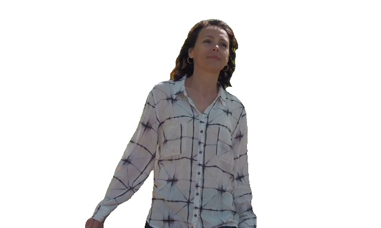
    </td>
    <td style="border:0;padding:10px;">
      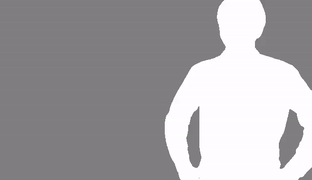
    </td>
  </tr>
  <tr>
    <td align="center" style="border:0;padding-top:6px;font-weight:700;">Reference Image</td>
    <td align="center" style="border:0;padding-top:6px;font-weight:700;">Mask Video</td>
  </tr>
  <tr>
    <td style="border:0;padding:10px;">
      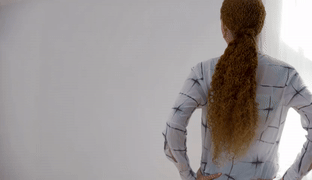
    </td>
    <td style="border:0;padding:10px;">
      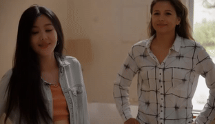
    </td>
  </tr>
  <tr>
    <td align="center" style="border:0;padding-top:6px;font-weight:700;">VACE-2.2-14B</td>
    <td align="center" style="border:0;padding-top:6px;font-weight:700;">OmniVCus-2.2-14B (Ours)</td>
  </tr>
</table>
</p>


Please enter the subfolder [`DiffSynth-Studio`](https://github.com/caiyuanhao1998/Open-OmniVCus/tree/master/DiffSynth-Studio) for detailed instruction to train and test the models.


&nbsp;

## 3. Citation
```sh
@inproceedings{omnivcus,
  title={OmniVCus: Feedforward Subject-driven Video Customization with Multimodal Control Conditions},
  author={Yuanhao Cai and He Zhang and Xi Chen and Jinbo Xing and Kai Zhang and Yiwei Hu and Yuqian Zhou and Zhifei Zhang and Soo Ye Kim and Tianyu Wang and Yulun Zhang and Xiaokang Yang and Zhe Lin and Alan Yuille},
  booktitle={NeurIPS},
  year={2025}
}
```
&nbsp;

`Acknowledgments:` Our code is built upon and inspired by [Wan2.1](https://github.com/Wan-Video/Wan2.1), [Wan2.2](https://github.com/Wan-Video/Wan2.2), [VACE](https://github.com/ali-vilab/VACE), [DiffSynth-Studio](https://github.com/modelscope/DiffSynth-Studio), [SAM2](https://github.com/facebookresearch/sam2), [Depth-Anything-V2](https://github.com/DepthAnything/Depth-Anything-V2), [Video-Depth-Anything](https://github.com/DepthAnything/Video-Depth-Anything), [CoTracker3](https://github.com/facebookresearch/co-tracker). We thank their solid open-source work.
