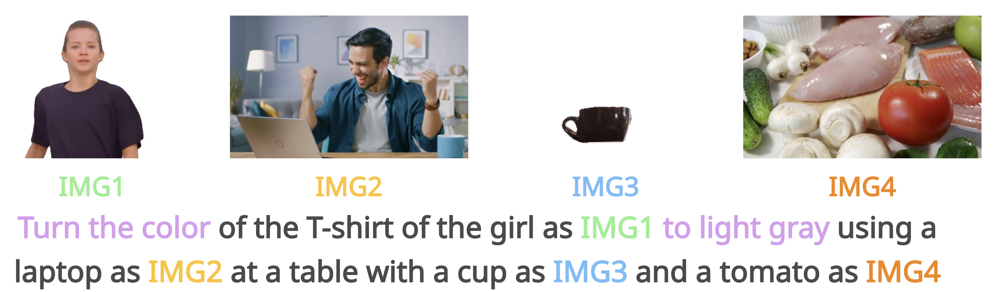

&nbsp;

<div align="center">

<h3>OmniVCus: Feedforward Subject-driven Video <br> Customization with Multimodal Control Conditions</h3> 

[](https://arxiv.org/abs/2411.14384)
[](https://caiyuanhao1998.github.io/project/OmniVCus/)
[](https://huggingface.co/datasets/CaiYuanhao/OmniVCus)

<p align="center">
  
  
</p>
<p align="center">
  
  
</p>


&nbsp;

</div>


### Introduction
This is an implementation of our work "OmniVCus: Feedforward Subject-driven Video Customization with Multimodal Control Conditions". In this work, we present a data construction pipeline that can create data pairs and a diffusion Transformer for subject-driven video customization under different control conditions. If you find our repo useful, please give it a star ⭐ and consider citing our paper. Thank you :)


<p align="center">
  
</p>

<p align="center"><strong>Figure 2:</strong>The overall framework of our OmniVCus</p>


### News
- **2025.06.30 :** Our paper is on [arxiv](https://arxiv.org/abs/2411.14384) now. 🚀
- **2025.06.28 :** Our [project page](https://caiyuanhao1998.github.io/project/OmniVCus/) has been built up. Feel free to check the video generation results on the project page.


### Comparison with State-of-the-Art Methods

<details open>
<summary><b>Qualitative Comparison</b></summary>

&nbsp;

<p align="center"> Prompt: The woman in <span style="color: green;">IMG1</span> is talking to a man on a street </p> 


<p align="center">Top-left: Input Image. Top-right: SkyReels-A2. Bottom-left: OmniGen + Wan2.1-I2V. Bottom-right: Ours. </p> 

</details>


<details close>
<summary><b>Quantitative Comparison</b></summary>


</details>


&nbsp;

## Citation
```sh
@article{omnivcus,
  title={OmniVCus: Feedforward Subject-driven Video Customization with Multimodal Control Conditions},
  author={Yuanhao Cai and He Zhang and Xi Chen and Jinbo Xing and Kai Zhang and Yiwei Hu and Yuqian Zhou and Zhifei Zhang and Soo Ye Kim and Tianyu Wang and Yulun Zhang and Xiaokang Yang and Zhe Lin and Alan Yuille},
  journal={arXiv preprint arXiv:2506.6579457},
  year={2025}
}
```
