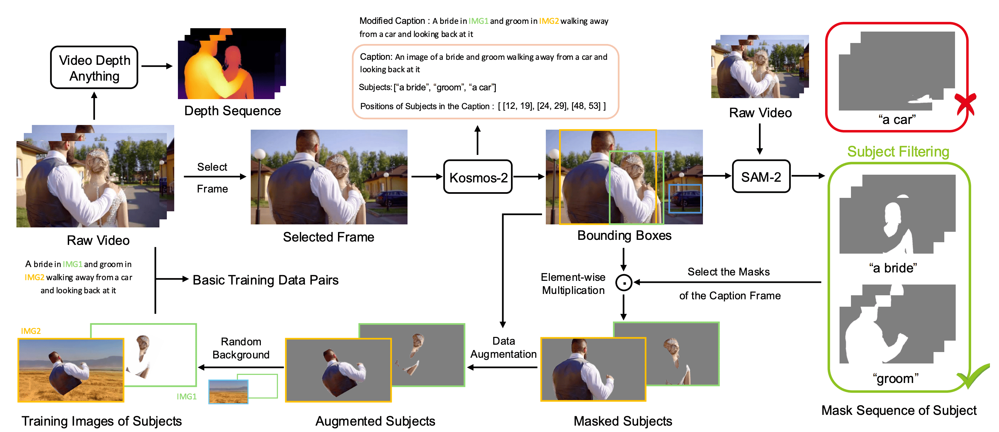

&nbsp;

<div align="center">

<p align="center">  </p>

[](https://arxiv.org/abs/2411.14384)
[](https://caiyuanhao1998.github.io/project/OmniVCus/)
[](https://huggingface.co/datasets/CaiYuanhao/OmniVCus)
<h3>OmniVCus: Feedforward Subject-driven Video <br> Customization with Multimodal Control Conditions</h3> 

<p align="center">
  
  
  
  
</p>


&nbsp;

</div>


### Introduction
This part of code implements our data construction pipeline, VideoCus-Factory, for multi-modal control subject-driven video customization. If you find our repo useful, please give it a star ⭐ and consider citing our paper. Thank you :)

&nbsp;

<p align="center">
  
</p>

<p align="center"><strong>Figure 1:</strong> Our Data Construction Pipeline - VideoCus-Factory</p>


&nbsp;

Using our data construction pipeline can generate training data pairs and control conditions from only video data for multi-modal subject-driven video customization. An example is shown as follow.

<p align="center">
<table border="0" cellspacing="0" cellpadding="0" style="border-collapse:collapse;border:0;">

  <!-- ===== Row 1 Prompt ===== -->
  <tr>
    <td colspan="3" align="center" style="border:0;padding:6px 10px;font-style:italic;">
      Generated Prompt: a woman and a child playing with a toy train.
    </td>
  </tr>
  <tr>
    <td style="border:0;padding:10px;">
      
    </td>
    <td style="border:0;padding:10px;">
      
    </td>
    <td style="border:0;padding:10px;">
      
    </td>
  </tr>

  <tr>
    <td align="center" style="border:0;padding-top:6px;font-weight:700;">Original Video</td>
    <td align="center" style="border:0;padding-top:6px;font-weight:700;">Segmented Subject</td>
    <td align="center" style="border:0;padding-top:6px;font-weight:700;">Augmented Subject</td>
  </tr>

  <tr>
    <td style="border:0;padding:10px;">
      
    </td>
    <td style="border:0;padding:10px;">
      
    </td>
    <td style="border:0;padding:10px;">
      
    </td>
  </tr>

  <tr>
    <td align="center" style="border:0;padding-top:6px;font-weight:700;">Depth Video</td>
    <td align="center" style="border:0;padding-top:6px;font-weight:700;">Mask Video</td>
    <td align="center" style="border:0;padding-top:6px;font-weight:700;">Motion Video</td>
  </tr>

</table>
</p>

&nbsp;

## 1. Environment Installation

```bash
conda create -n videocus_factory python=3.10 -y

conda activate videocus_factory

pip install -e .

pip install transformers==4.47.1

pip install imageio[ffmpeg]

pip install opencv-python
```

&nbsp;

## 2. Data Preparation
We suggest you download the VidGen-1M as the original text-video data pool.

```sh
git lfs install
git clone https://huggingface.co/datasets/Fudan-FUXI/VIDGEN-1M

# or using the huggingface_hub
pip install -U "huggingface-hub==0.26.2" --force-reinstall
```

Place them into the path `T2V_data` and organize them as

```sh
|--T2V_data
  |--VIDGEN-1M
    |-- VidGen_1M_video_caption.json
    |-- VidGen_video_0.zip
    |-- VidGen_video_1.zip
    |-- ...
    |-- VidGen_video_2047.zip
  |--VIDGEN-1M_unzip
    |-- NjDCwU95uGM-Scene-0013.mp4
    |-- eK1N96Zwt-U-Scene-0013.mp4
    |-- x8qD1uU7Hng-Scene-0009.mp4
    |-- y8IQw4dn-JE-Scene-0056.mp4
    |-- zt1GLX-vGl4-Scene-0077.mp4
    |-- ...
```

Download the T2I data as teh random background, place them under the folder `T2I_data`

```sh
mkdir T2I_data
cd T2I_data
huggingface-cli download jackyhate/text-to-image-2M \
    --repo-type dataset \
    --local-dir data_1024_10K \
    --include "data_1024_10K/*"
```

with the following folder structure

```sh
|--T2I_data
  |--data_1024_10K
    |--data_000000
      |--flux_1024_10k_00000000.jpg
      |--flux_1024_10k_00000000.json
      |--flux_1024_10k_00000001.jpg
      |--flux_1024_10k_00000001.json
      |--flux_1024_10k_00000002.jpg
      |--flux_1024_10k_00000002.json
      |--...
```


Download our processed data from the [huggingface website](https://huggingface.co/datasets/CaiYuanhao/OmniVCus-Train) as

```sh
git clone https://huggingface.co/datasets/CaiYuanhao/OmniVCus-Train
```

Then place our data into the folder `T2V_data` with the following structure as

```sh
|--T2V_data
  |--json_files
    |--part_0.json
    |--...
    |--part_7.json
  |--label
    |--part_0
    |--...
    |--part_7
  |--train_csv
    |--part_0_aug_depth.csv
    |--part_0_aug_mask.csv
    |--part_0_aug.csv
    |--part_0.csv
    |--...
    |--part_7_aug_depth.csv
    |--part_7_aug_mask.csv
    |--part_7_aug.csv
    |--part_7.csv
    |--part_all_aug_depth.csv
    |--part_all_aug_mask.csv
    |--part_all_aug.csv
    |--part_all.csv
```

`Note:` The folder `json_files` is used for constructing multi-modal control conditions. The folder `label` is our processed data ready to use. 
The folder `train_csv` contains the csv files used to train the T2V models.

&nbsp;

## 3. Download Foundation Model Checkpoints

Our data construction pipeline needs the following foundation models. Please download them and place them into the folder `checkpoints/`

```sh
# sam2_hiera_large
cd checkpoints && \
./download_ckpts.sh && \
cd ..

# kosmos-2
git clone https://huggingface.co/microsoft/kosmos-2-patch14-224

# if you failed, please try huggingface-cli
huggingface-cli download microsoft/kosmos-2-patch14-224 --local-dir checkpoints/kosmos-2-patch14-224 --local-dir-use-symlinks False
```
`Note:` for other foundation model checkpoints, you can use auto-downloading in our data construction code.


&nbsp;

## 4. Construct Multi-modal Control Conditions
We have provided 135K processed data in the folder `T2V_data/label`. They are ready to use for training with the csv files in the folder `T2V_data/train_csv`. 
If you want to construct the data your self, please run the following commonds to construct the corresponding control conditions
```sh
# 1. referece image condition & mask condition
. process_data_customization.sh

# 2. depth condition
. process_data_depth.sh

# 3. motion condition
. process_data_track.sh
```
Please note that the depth condition here is predicted from the `Depth-Anything-V2` model. Yet the `Video-Depth-Anything` model is more advanced. Please enter the folder [`Open-OmniVCus/Video-Depth-Anything`](https://github.com/caiyuanhao1998/Open-OmniVCus/tree/master/Video-Depth-Anything) if you want to use the better model.

We also provide the code visualize the track in video, please run

```sh
. track_vis.sh
```

After constructing the data, you need to generate the csv file for training, run

```sh
python generate_csv_for_all_parts.py
```

After constructing the data, to avoid copy-paste issue in the constructed videos, please run our data augmentation code for the reference image

```sh
. data_augmentation.sh
```

Then generate the csv training files for the augmented data

```sh
python convert_csv.py
```

&nbsp;

## 5. Citation
```sh
@inproceedings{omnivcus,
  title={OmniVCus: Feedforward Subject-driven Video Customization with Multimodal Control Conditions},
  author={Yuanhao Cai and He Zhang and Xi Chen and Jinbo Xing and Kai Zhang and Yiwei Hu and Yuqian Zhou and Zhifei Zhang and Soo Ye Kim and Tianyu Wang and Yulun Zhang and Xiaokang Yang and Zhe Lin and Alan Yuille},
  booktitle={NeurIPS},
  year={2025}
}
```